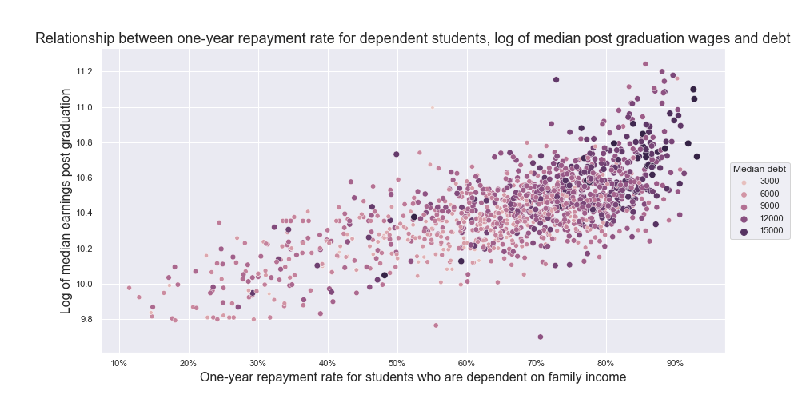
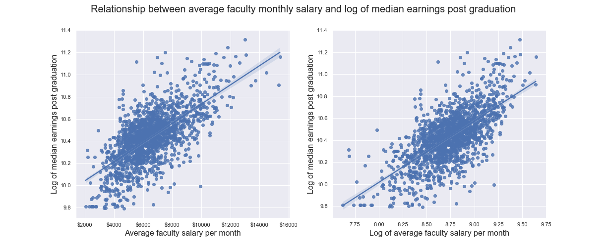
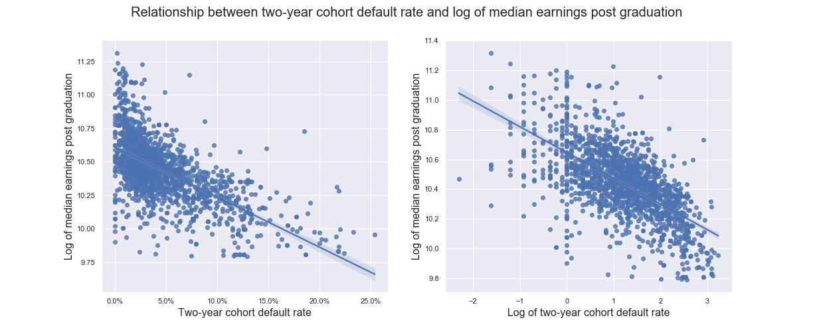
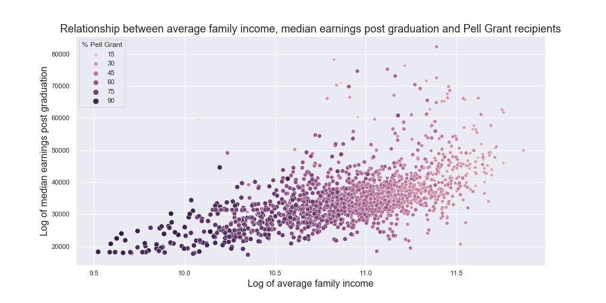
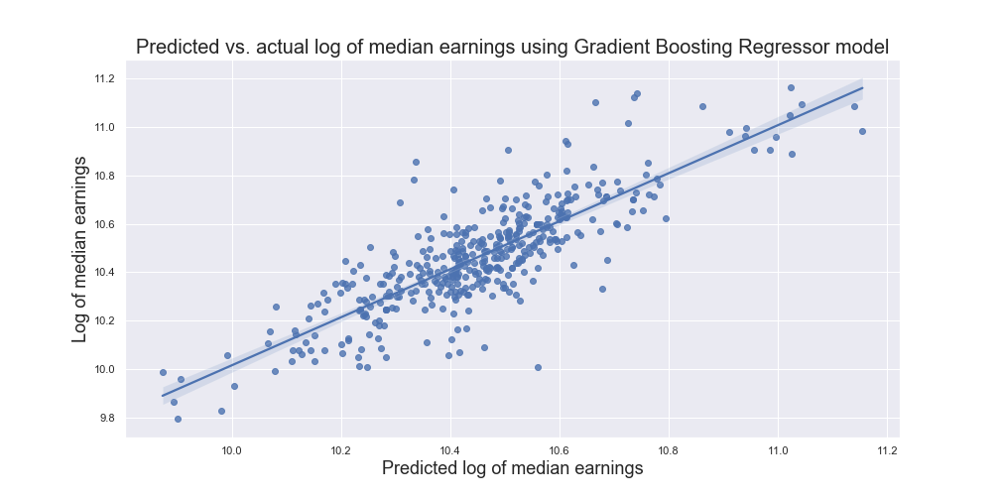

### Problem Statement:

Attending higher education is a pathway to economic mobility for many Americans. Pursuing a higher education degree is expected to result in increased earnings potential over a lifetime. Data from the U.S. Department of Education College Scorecard show that outcomes such as wages post graduation vary among institutions based on their characteristics, policies, and in some cases, students' backgrounds. The [College Scorecard](https://collegescorecard.ed.gov/) provides a wealth of information to students to identify colleges and graduate schools that will match their desired characteristics and earnings potentials.

In addition, State education agencies use accountability systems that rely on performance-based measures to allocate funding to higher education institutions. Particularly, in Florida and Kansas, student wages post graduation are used as a performance measure [(Using Federal Data to Measure and Improve the Performance of U.S. Institutions of Higher Education, page 16)](https://collegescorecard.ed.gov/assets/UsingFederalDataToMeasureAndImprovePerformance.pdf). Understanding how changing institutional policies, such as admissions policies, allows university administrators to evaluate the effect of those changes on key performance indicators.

The goal of this analysis will be to predict median earnings six years after graduation for institutions whose highest awarded is a Bachelor's or Graduate degree in the 2008-2009 academic year whose earnings were measured in 2014-2015 using multiple linear regression, Lasso, Ridge, Random Forest, Extra-trees Forest, and Gradient Boost Regressor models. A Flask application is in development to allow university administrators to change institutional characteristics and policies in the model and evaluate the effect on median earnings post graduation.

The results of this analysis will be presented to State University Systems and higher education institutions to engage in conversations about what institutional policies can be adapted to improve student outcomes.

The success of this project will be evaluated based on:
* The R-squared and root mean squared error of the regression model used to predict median earnings

### Data:

The data sources used for this analysis include:
* **[College Scorecard](https://collegescorecard.ed.gov/data)**: A data set of higher-education characteristics and student outcomes from the U.S. Department of Education.
* **[National Science Foundation Higher Education Research and Development Survey (HERD)](https://www.nsf.gov/statistics/herd/pub_data.cfm)**: A data set containing research and development expenditures at higher education institutions.
* **[Integrated Postsecondary Database System](https://nces.ed.gov/ipeds/use-the-data)**: A database of higher education institution and student attributes. 

Additional data from Niche[Niche](https://www.niche.com/colleges/search/best-colleges/), a higher education rankings company, will be obtained through webscrapping and used in exploratory data analysis.

#### Data Dictionary

The following data dictionary lists the features used in this analysis:

| Feature Name | Description |
|:---|:---|
| md_wne_earn_p6 | Medain earnings six years post graduation measured in 2014-2015 for graduates from the 2008-2009 academic year|
| log_earnings | Log of median earnings |
| pell_ever | Share of students who received a Pell Grant while in school |
| par_ed_pct_hs | Percent of students whose parents' highest educational level is high school |
| faminc | Average family income in real 2015 dollars |
| satmtmid | Midpoint of SAT scores at the institution (math) |
| dep_rpy_1yr_rt | Fraction of repayment cohort of dependent students who are not in default, and with loan balances that have declined one year since entering repayment |
| avgfacsal | Average faculty monthly salary |
| cdr2 | Two-year cohort default rate |
| private_np | Indicator for whether an institution is a private non-profit |
| public | Indicator for whether an institution is public |
|med_earnings_growth|Percentage change in median earnings between 2003-2004 and 2013-2014 academic years|
|high_research_and_grad|Binary feature to categorize institutions based on whether they have high research activity or offer Graduate programs based on the Carnegie Classification of Institutions of Higher Education|

When analyzing these data, it is important to keep in mind that it is not fully representative of all U.S. students at higher education institutions but of those who received financial aid.

### Methodology:

This analysis will follow these steps in the prediction of student outcomes:

1. Cleaning of College Scorecard and HERD data
2. Explonatory Data Analysis
3. Web-scrapping of student institution reviews and sentiment analysis of student reviews
4. Developing one data source from the three data sets
5. Missing data imputation techniques
6. Feature engineering
7. Estimation of multiple linear regression model and ensemble models
8. Grid search and regularization
9. Principal component analysis
10. Model evaluation
11. Model selection
12. Model deployment and visualization using Flask

### Results

The repayment rate among dependent students is a strong predictor of median earnings post graduation. The scatterplot below presents a moderate positive relationship between median earnings and the repayment rate. It appears that higher earnings and repayment rates are also positively associated with higher median debt values.

Average faculty monthly salary is also a strong predictor of median earnings post graduation. As the average monthly salary increases, the median earnings amounts also tend to increase. The log-transformation of this feature is a more suitable predictor of median earnings.

Two-year cohort default rates are also relevant predictors of median earnings. As the two year cohort default rate increases, median earnings tend to decrease.

There is a positive relationship between median earnings and family income. On average, as family income increases, the median earnings also tend to increase. However, these two features also hold a negative relationship with the percentage of students who have received a Pell grant. As this percentage increases, the median earnings tend to decrease.

The following are the modeling results based on the linear regression and ensemble regressor models.

|Model|Mean R-squared|2 Standard deviations from mean R-squared|
|:---|:---|:---|
|Null model|0|0|
|Multiple linear regression|0.6844|±0.007|
|Lasso|0.6811|±0.0076|
|Ridge regression|0.6845|±0.007|
|Random forest regressor|0.6801|±0.0063|
|Extra-trees regressor|0.6829|±0.0069|
|Gradient boost regressor|0.6938|±0.0064|

The model that performed the best on an unseen data set was the Gradient Boost Regressor model. The plot below demonstrates a moderately strong positive relationship between the actual log earnings and predicted log earnings features, with a Pearson correlation coefficient of .84.

### Conclusion

Higher education administrators and state education agencies must consider policy changes aimed at increasing access to higher education for underserved communities. Policy options that are available include implementing an open admissions policy and increasing the share of students who have ever received a Pell Grant. This analysis found that having an open admissions policy is not a strong predictor of median earnings post graduation, an accountability measure to evaluate the effectiveness of higher education institutions in matching graduates to high quality jobs.

Using data from the U.S. Department of Education's College Scorecard, this analysis found that an increase in the share of students who have ever received a Pell Grant is associated with a 7.3% decrease in median earnings and 2.1% decrease for public institutions. This should not discourage higher education administrators from enrolling students with high financial need, or Pell Grant students, but rather should encourage them to recognize that the challenge of supporting these students in obtaining high paying jobs may require more academic and non-academic supports to ensure any opportunity gaps are closed for these students. 

Among all institutions, the one-year repayment rate for dependent students is a strong predictor of median earnings post graduation. A one unit increase in this rate is associated with a 4.9% increase in median earnings a slight 0.6% reduction for public institutions. This information can help higher education administrators monitor the economic outcomes of students over time and analyze data of students lagging behind in earnings outcomes to understand what added supports may be necessary for students to achieve better outcomes. Sustaining improvements in student outcomes over time can be expected to result in improvements in median earnings. A one percentage increase in the median earnings growth in a 10-year period is associated with a 6% increase in median earnings. 

Worse financial outcomes are also red flags that higher education admnistrators and state education agencies should pay attention to. Higher two-year cohort educational loan default rates are associated with a 5.4% reduction in median earnings. On average, a percentage increase in average monthly faculty salaries is associated with a 7.4% median earnings. This may reflect the fact that some of the institutions with higher resources may enroll students with higher family incomes, who are more likely to have higher earnings themselves.

The model created in this analysis predicted median earnings six years post graduation by explaining around 70% of the variation in this feature. This model can be used to generate debate and conversation institutional and across institutions about what policy changes and red flags should be considered when evaluating their effect on important student outcomes such as earnings post graduation. 

### Executing this project:
To execute this project, please download the following data sources:
1. All College Scorecard Data Files in [this](https://data.ed.gov/dataset/college-scorecard-all-data-files/resources) website
2. The 2009 Fall Enrollment file (EF2009D) from [this](https://nces.ed.gov/ipeds/datacenter/DataFiles.aspx?year=2009) site
3. The 2009 Institutional Characteristics [data](https://nces.ed.gov/ipeds/datacenter/DataFiles.aspx?gotoReportId=7&fromIpeds=true) from IPEDS
4. The Higher Education Research and Development Expenditures Survey from the National Science Foundation for fiscal year 2010 [here](https://www.nsf.gov/statistics/herd/pub_data.cfm)

### Executing the Flask app'
1. Within the `apps` folder, run the script named `earnings_and_default.py`
2. Go to http://localhost:4000/page
3. Change the inputs in the app and visualize the results

Note: As of March 29, 2022, the app is under development.